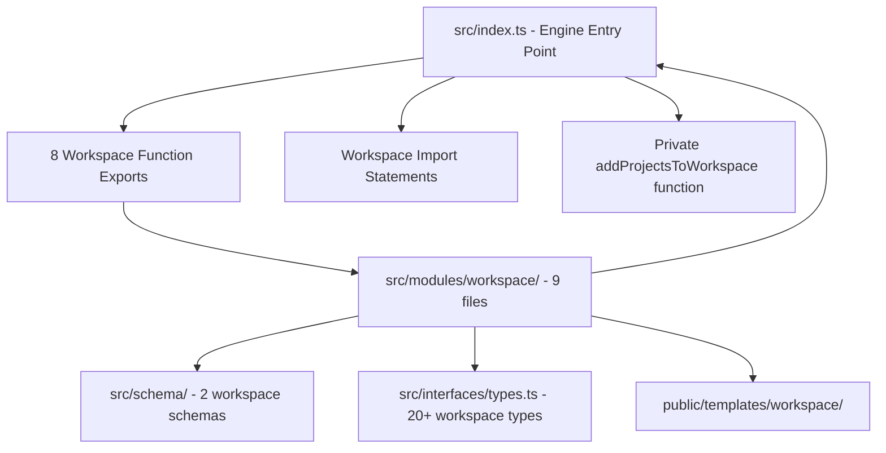

# Workspace Migration — Implementation Guide

Reference document: `WORKSPACE_MIGRATION.md` (docs folder)

---

## Scope

**In scope:**
- Extract all workspace modules from `src/modules/workspace/` to new package
- Update `extractBaseWorkspace` to use Sonatype download instead of local ZIP
- Copy shared utilities and types required by workspace functionality
- Move workspace schemas and templates to new package
- Create `@igrp/igrp-workspace-engine` as standalone npm package
- Remove all workspace exports and imports from `nextjs-engine`

**Out of scope — do NOT touch these:**
- App, page, component, or process functionality
- Non-workspace docker services
- Core Next.js engine functionality
- Consumer applications (iGRP Studio) - they will update imports separately

---

## Acceptance Criteria (Definition of Done)

Verify all of the following before marking any task complete:

- [ ] New package `@igrp/igrp-workspace-engine` builds successfully
- [ ] `@igrp/igrp-studio-nextjs-engine` builds without workspace code
- [ ] Zero import errors between packages
- [ ] `extractBaseWorkspace` downloads from Sonatype (no local ZIP dependency)
- [ ] All 8 workspace functions exported from new package
- [ ] Workspace types and schemas moved to new package
- [ ] Essential .env templates moved (no docker-compose templates)
- [ ] Shared utilities copied (not moved) to new package
- [ ] Docker service name constants available in new package
- [ ] All workspace tests pass in new package
- [ ] Engine tests pass with workspace code removed

---

## Failure Strategy

If a step below causes a compilation error or test failure, follow this procedure before proceeding:

1. **Import error after moving modules** — check if the module imports shared utilities. If yes, copy the utility to the new package and update the import path. Do not move utilities that are used by non-workspace modules.

2. **Build failure after updating extractBaseWorkspace** — verify the Sonatype URL is correct and the ZIP structure matches expectations. Check if `extractZipFromUrl` is imported properly from zip utilities.

3. **Type errors in new package** — ensure all workspace types are copied to `src/interfaces/types.ts`. Check if `RenderContext` needs adjustment for workspace-only usage.

4. **Template resolution errors** — verify the new package's path resolution points to its own `public/templates/` directory, not the engine's templates.

5. **Missing constants error** — copy the required docker service name constants to the new package. Update imports in workspace modules to use local constants.

Do not suppress errors with `any` types or comment out code. Fix the root cause.

---

## Troubleshooting and Known Issues

| Error | Reason | Solution |
| :--- | :--- | :--- |
| `Cannot find module '../../index'` | `extractBaseWorkspace` still imports from engine entry point | Update to use Sonatype download with `extractZipFromUrl` |
| `Cannot find module '../../docker_services/'` | Workspace modules import engine docker services | Copy docker service name constants to new package |
| `Property 'getPaths' does not exist` | Workspace code uses engine path resolution | Create independent path resolution in new package |
| `Cannot find workspace type` | Workspace types not copied to new package | Copy all workspace types from `src/interfaces/types.ts` |
| Template not found errors | Path resolution points to engine templates | Update to use new package's `public/` directory |
| Build fails with missing utilities | Shared utilities not copied | Copy required utilities from `src/utils/` and `src/modules/common/` |

---

## Link Points — What Must Be Removed

Work through these in order. Complete one section fully before moving to the next.

### 1. Workspace exports from engine entry point

| File | Lines | Action |
|---|---|---|
| `src/index.ts` | 1-50 | Remove all 8 workspace function exports |
| `src/index.ts` | 50-100 | Remove workspace-related import statements |
| `src/index.ts` | 100-150 | Remove private `addProjectsToWorkspace` function |

**Verify:** Engine `src/index.ts` has zero workspace imports and exports.

### 2. Workspace modules directory

| Directory | Action |
|---|---|
| `src/modules/workspace/` | Move all 9 files to new package |

Files to move:
- `createWorkspaceDirectories.ts`
- `saveBaseWorkspaceFiles.ts`
- `saveBaseWorkspaceConfig.ts`
- `generateWorkspaceFiles.ts`
- `workspaceMapper.ts`
- `checkDuplicated.ts`
- `extractBaseWorkspace.ts`
- `generateVolumeFiles.ts`
- `saveWorkspaceComposeFile.ts`

**Verify:** `src/modules/workspace/` directory completely removed from engine.

### 3. Workspace schemas

| File | Action |
|---|---|
| `src/schema/baseWorkspace.ts` | Move to new package |
| `src/schema/workspaceProjectConfig.ts` | Move to new package |

**Verify:** Engine has no workspace-related schema files.

### 4. Workspace types from interfaces

| File | Lines | Action |
|---|---|---|
| `src/interfaces/types.ts` | All workspace types | Remove 20+ workspace-specific interfaces and types |

Types to remove:
- `WorkspaceConfig`, `WorkspaceProjectsConfig`, `WorkspaceProject`
- `WorkspaceService`, `ProjectWorkspace`, `ServiceWorkspace`
- `DockerContainer`, `DockerServiceConfig` and all docker-related types
- `Environment`, `Port`, `Volume`, `Network`, etc.

**Verify:** Engine types file contains only app/page/component types.

### 5. Workspace templates

| Directory | Action |
|---|---|
| `public/templates/workspace/` | Move only .env templates to new package |

Move these files:
- `al-igrp-env.hbs`, `am-igrp-env.hbs`, `appm-igrp-env.hbs`
- `file-igrp-env.hbs`, `iam-igrp-env.hbs`
- `igrp-env.hbs`, `service-env.hbs`, `ui-igrp-env.hbs`, `um-igrp-env.hbs`

Delete these files (replaced by Sonatype ZIP):
- `docker-compose-workspace.hbs`
- `nginx.conf.hbs`
- `redis.conf.hbs`

**Verify:** Engine has no workspace template files.

### 6. Update extractBaseWorkspace function

| File | Lines | Action |
|---|---|---|
| `src/modules/workspace/extractBaseWorkspace.ts` | 1-50 | Replace `getPaths()` import with Sonatype URL config |
| `src/modules/workspace/extractBaseWorkspace.ts` | 50-100 | Replace `extractZipFile()` with `extractZipFromUrl()` |
| `src/modules/workspace/extractBaseWorkspace.ts` | 100-150 | Add placeholder replacement logic after extraction |

**New behaviour:** Download workspace template from Sonatype, extract ZIP, replace placeholders with values from `.igrpstudio/workspace.json`.

### 7. Copy shared utilities to new package

| Source File | Destination | Action |
|---|---|---|
| `src/modules/common/saveToFile.ts` | `src/modules/common/` | Copy entire file |
| `src/modules/common/renderTemplate.ts` | `src/modules/common/` | Copy entire file |
| `src/utils/helpers.ts` | `src/utils/` | Copy workspace functions only |
| `src/helpers/workspaceHelper.ts` | `src/helpers/` | Copy entire file |
| `src/utils/ajv-instance.ts` | `src/utils/` | Copy entire file |
| `src/utils/constants.ts` | `src/utils/` | Copy workspace constants only |

**Verify:** All copied utilities have updated import paths for new package structure.

### 8. Copy docker service constants

| Source | Destination | Action |
|---|---|---|
| `src/docker_services/*/index.ts` | `src/docker_services/` | Copy name constants only |

Services to copy:
- `NGINX`, `POSTGRES`, `KEYCLOAK`, `REDIS`, `MINIO`
- `IGRP_ACCESS_MANAGEMENT`, `IGRP_APPLICATION_CENTER`
- `IGRP_API_GATEWAY`, `EUREKA`, `PGADMIN`

**Verify:** Each service file exports only the name constant string.

---

## What the Final State Looks Like

Every arrow in this diagram must be gone. If any arrow remains, the task is not complete.



---

## Validation Commands

```bash
# In new workspace-engine package
npm run build
npm test

# In modified nextjs-engine
npm run build
npm test

# Verify no workspace imports remain
grep -r "workspace" src/ --exclude-dir=node_modules
grep -r "WorkspaceConfig" src/ --exclude-dir=node_modules
```
