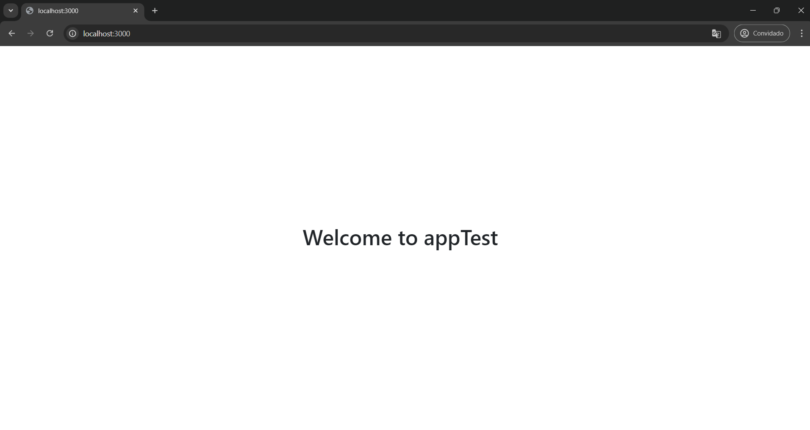
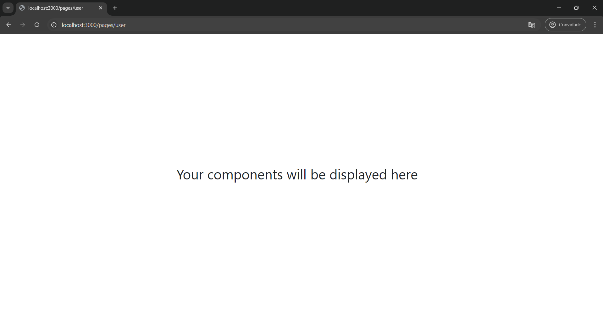
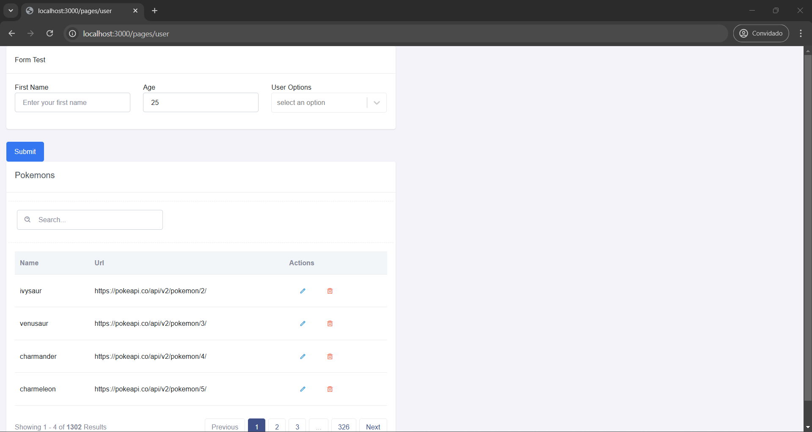
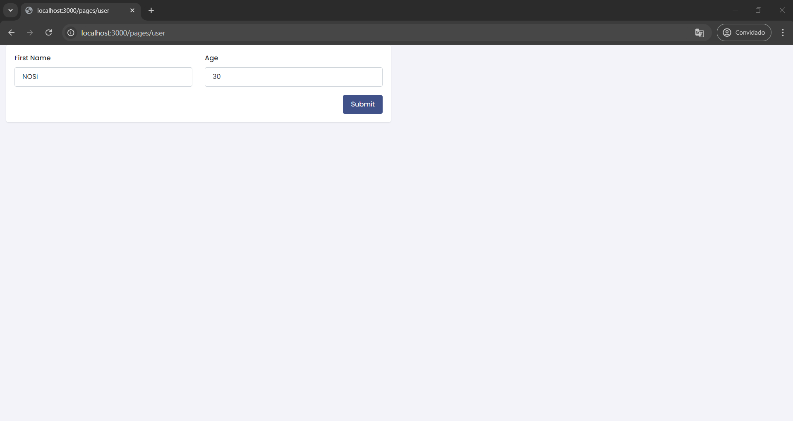

# Application Execution Guide

## Project Description
This application is developed using TypeScript and Handlebars. It allows users to quickly and easily create configurable Next.js applications with TypeScript. Once the application is created, users can also create pages and add or remove components from those pages, providing a flexible and efficient way to manage their Next.js projects.

## Prerequisites

Before running this application, ensure the following software is installed on your machine::

- [Nodejs](https://nodejs.org/en/download/package-manager/current)

## Installation and Execution Steps

### 1. Download the Project:

Clone or download the project to your local machine.

### 2. Install Dependencies:

Navigate to the project's root directory and run the following command to install all necessary dependencies:

```bash
npm install
```

### Running Tests:

To run tests, execute the following command, replacing fileNameTest with the name of the test file you want to run:

```bash 
npm test fileNameTest
```
You can find all test files in the test directory

### Important Notes

- To get accurate test results, ensure that the tests not of current interest are commented out. This will help you focus on the results of the specific tests you wish to evaluate.


## Examples of use as a package:

### Install the package:
In your project 
```bash
yarn add @igrp/nextjs-engine@0.0.1 --registry=https://sonatype.nosi.cv/repository/npm-group/
```

### Using the Package:

You can use this package to:
- #### create a Next.js application. 
The following example demonstrates how to initialize and set up a base structure for an application based on the provided configuration:


```typescript
import { newApp } from '@igrp/nextjs-engine';
import { AppConfig } from '@igrp/nextjs-engine/dist/interfaces/types';

const basePath = 'Path where the application will be created';

const appConfig: AppConfig = {
  type: 'baseApp',
  appName: 'appTest',
};

const createApp = async () => {
  try {
    await newApp(appConfig, basePath);
    console.log('App created successfully');
  } catch (error) {
    console.error('Error when creating project:', error);
  }
};

createApp();
```
Open a terminal in the generated application root directory or use a code editor with an integrated terminal. Then, run the following command to install all the project dependencies:
```bash
yarn
```
Once the dependencies are installed, run the following command to start the application in development mode:
```bash
yarn run dev
```
If all went well, the application will be running at the following URL:
```bash
http://localhost:3000
```
Open that address in your browser and you should see the welcome page, similar to the one shown in the image below.


- #### add Page to the Application
```ts
import { newPage } from '@igrp/nextjs-engine';
import { PageConfig } from '@igrp/nextjs-engine/dist/interfaces/types';

const pageConfig: PageConfig = {
  type: 'page',
  pageName: 'user',
  path: 'users',
  components: [],
};

const createPage = async () => {
  try {
    await newPage(pageConfig, basePath);
    console.log('Page created successfully');
  } catch (error) {
    console.error('Error when creating page:', error);
  }
};

createPage();
```
After running the above code, you can view the created page by navigating to the following URL in your browser:
```bash
http://localhost:3000/pages/user
```


#### Add Components to the Page
```ts
import { addComponentToPage } from '@igrp/nextjs-engine';
import { PageConfig, Component } from '@igrp/nextjs-engine/dist/interfaces/types';

const pageConfig: PageConfig = {
  type: 'page',
  pageName: 'user',
  path: 'users',
  components: [],
};

const components: Component [] = [
  {
    Row: [
      {
        Col: [
          {
            componentName: 'FormLayout',
            config: {
              title: 'Form Test',
              colSize: 6
            },
            fields: [
              {
                type: 'TextInput',
                config: {
                  type: 'text',
                  name: 'firstName',
                  label: 'First Name',
                  placeholder: 'Enter your first name',
                  colSize: 6,
                },
              },
              {
                type: 'NumberInput',
                config: {
                  type: 'number',
                  name: 'age',
                  label: 'Age',
                  placeholder: 'Enter your age',
                  colSize: 6,
                },
              }
            ],
          }
        ]
      }
    ]
  },
];

const addComponent = async () => {
  try {
    await addComponentToPage(pageConfig, components, basePath);
    console.log('Components added successfully');
  } catch (error) {
    console.error('Error when adding components to page:', error);
  }
};

addComponent();

```
You should now see the new components added, such as the form shown in the image in the next section.


The form inputs are initially empty. To populate them with test data or any other data, it is necessary to implement the interface methods in the generated service.

### Implementacion del servicio:
Follow the steps below to implement the service logic in the form:
1. Update the UserService.ts file located in services/user/UserService.ts with the following code:
```ts
export const UserService: IuserService = {
  form00: {
    populate: () => ({firstName:'NOSi', age:30}),
    action: (vals) => console.log(vals)
  }
}
```
- Now, when you load the form, the First Name and Age fields should be pre-filled with the data provided by the service (firstName: 'NOSi' and age: 30).
- When you click the Submit button, the current values ​​of the form will be printed to the console.



#### Delete Page
You can delete the page you created using the following example:
```ts
import { deletePage } from '@igrp/nextjs-engine';

const pageConfig: PageConfig = {
  type: 'page',
  pageName: 'user',
  path: 'users',
  components: [],
};

const removePage = async () => {
  try {
    await deletePage(pageConfig, basePath);
    console.log('Page removed successfully');
  } catch (error) {
    console.error('Error when removing page:', error);
  }
};

removePage();
```

### Types and Interfaces
```ts
export interface AppConfig {
  type: 'baseApp';
  appName: string;
}

export interface PageConfig {
  type: 'page';
  pageName: string;
  path: string;
  components?: Component[];
}

export interface Component {
  Row: RowLayout[];
}

export interface RowLayout {
  Col: ColumnLayout[];
  
}

export interface ColumnLayout {
  config?: ComponentConfig,
  componentName: ComponentNames;
  fields?: Field[];
}

export interface Field {
  type: string;
  config: FieldConfig;
}

export interface ComponentConfig {
  title?: string
  colSize?: number,
  submitBtnText?: string;
}

export interface FieldConfig {
  type: FieldTypes;
  name: string;
  label?: string;
  colSize?: number;
  placeholder?: string;
}

export type RenderContext<T = undefined> = {
  resourceConfig: T;
  basePath: string;
  baseConfig?: AppConfig;
  velzonImports?: string[];
};

```
## End
#### To read more valuable information about the NextJS Engine, we recommend taking a look at its corresponding documentation.