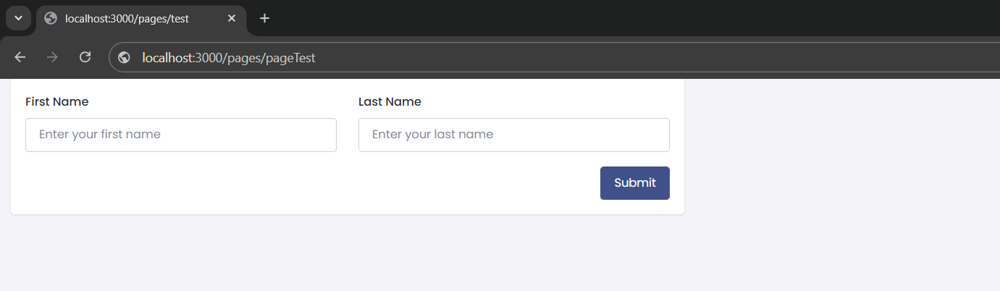

# Application Execution Guide

## Project Description
This application is developed using TypeScript and Handlebars. It allows users to quickly and easily create configurable Next.js applications with TypeScript. Once the application is created, users can also create pages and add or remove components from those pages, providing a flexible and efficient way to manage their Next.js projects.

## Prerequisites

Before running this application, ensure the following software is installed on your machine::

- [Nodejs](https://nodejs.org/en/download/package-manager/current)

## Installation and Execution Steps

### 1. Download the Project:

Clone or download the project to your local machine.

### 2. Install Dependencies:

Navigate to the project's root directory and run the following command to install all necessary dependencies:

```bash
npm install
```

### Running Tests:

To run tests, execute the following command, replacing fileNameTest with the name of the test file you want to run:

```bash 
npm test fileNameTest
```
You can find all test files in the test directory

### Important Notes

- To get accurate test results, ensure that the tests not of current interest are commented out. This will help you focus on the results of the specific tests you wish to evaluate.


## Examples of use as a package:

### Install the package:

```bash
yarn add nextjs-engine@1.0.2 --registry=https://sonatype.nosi.cv/repository/npm-group/
```

### Using the Package:

You can use this package to:
- #### create a Next.js application. 
The following example demonstrates how to initialize and set up a base structure for an application based on the provided configuration:


```typescript
import { newApp } from 'nextjs-engine';
import { AppConfig } from 'nextjs-engine/dist/interfaces/types';

const basePath = 'your path where the application will be created';

const appConfig: AppConfig = {
  type: 'baseApp',
  appName: 'nosi-frontend',
};

const createApp = async () => {
  try {
    await newApp(appConfig, basePath);
    console.log('App created successfully');
  } catch (error) {
    console.error('Error when creating project:', error);
  }
};

createApp();
```
- #### add Page to the Application
```ts
import { newPage } from 'nextjs-engine';
import { PageConfig } from 'nextjs-engine/dist/interfaces/types';

const pageConfig: PageConfig = {
  type: 'page',
  pageName: 'pageTest',
  path: 'test',
  components: [],
};

const createPage = async () => {
  try {
    await newPage(pageConfig, basePath);
    console.log('Page created successfully');
  } catch (error) {
    console.error('Error when creating page:', error);
  }
};

createPage();
```

#### Add Components to the Page
```ts
import { addComponentToPage } from 'nextjs-engine';
import { PageConfig, Component } from 'nextjs-engine/dist/interfaces/types';

const pageConfig: PageConfig = {
  type: 'page',
  pageName: 'pageTest',
  path: 'test',
};

const components: Component[] = [
  {
    Row: [
      {
        Col: [
          {
            colSize: 6,
            componentName: 'FormLayout',
            type: 'Form',
            attributes: [],
            submitBtnText: 'send',
            fields: [
              {
                type: 'FormInput',
                config: {
                  type: 'text',
                  name: 'firstNameinput',
                  label: 'First Name',
                  maxLength: 10,
                  minLength: 2,
                  placeholder: 'Enter your first name',
                  colSize: 6,
                },
              },
              {
                type: 'FormInput',
                config: {
                  type: 'text',
                  name: 'lastNameinput',
                  label: 'Last Name',
                  maxLength: 10,
                  minLength: 2,
                  placeholder: 'Enter your last name',
                  colSize: 6,
                },
              },
            ],
          },
        ],
      },
    ],
  },
];

const basePath = 'C:/Users/Eduardo Fernando/Documents/Wayvant/Proyecto Cabo Verde/Engines/test/app-nosi';

const addComponent = async () => {
  try {
    await addComponentToPage(pageConfig, components, basePath);
    console.log('Components added successfully');
  } catch (error) {
    console.error('Error when adding components to page:', error);
  }
};

addComponent();

```
## Run the Application
After generating the application and adding pages and components, follow these steps from the root directory of the application:

1. Install the project dependencies:
```bash
yarn
```
2. Add the required nosi-velzon-ts package:
```bash
yarn add nosi-velzon-ts@1.0.2 --registry=https://sonatype.nosi.cv/repository/npm-group/
```
3. Start the development server
```bash
yarn run dev
```
4. Once the server is running, open your browser and navigate to the following URL:
```bash
localhost:3000/pages/pageTest
```
If you have followed all the steps correctly, you should see something like this in your browser:





#### Delte Page
You can delete the page you created using the following example:
```ts
import { deletePage } from 'nextjs-engine';
import { PageConfig } from 'nextjs-engine/dist/interfaces/types';

const pageConfig: PageConfig = {
  type: 'page',
  pageName: 'pageTest',
  path: 'test',
  components: [],
};

const removePage = async () => {
  try {
    await deletePage(pageConfig, basePath);
    console.log('Page removed successfully');
  } catch (error) {
    console.error('Error when removing page:', error);
  }
};

removePage();
```

### Types and Interfaces
```ts
AppConfig {
  type: 'baseApp';
  appName: string;
}

PageConfig {
  type: 'page';
  pageName: string;
  path: string;
  components?: Component[];
}

Component {
  Row: RowLayout[];
}

RowLayout {
  Col: ColumnLayout[];
}

ColumnLayout {
  colSize: number;
  componentName: string;
  type: string;
  submitBtnText?: string;
  attributes: string[];
  fields?: Field[];
}

Field {
  type: string;
  config: FieldConfig;
}

FieldConfig {
  type: string;
  name: string;
  label?: string;
  maxLength?: number;
  minLength?: number;
  max?: number;
  min?: number;
  colSize: number;
  placeholder?: string;
}
```
