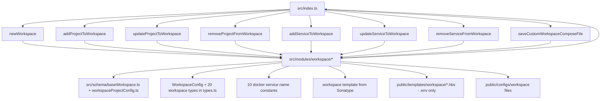

# Workspace Migration (Skill Reference)

This document is a skill reference for agents working on `igrp-studio-nextjs-engine`. It documents:
- the current architecture where workspace logic lives inside the Next.js engine
- the target architecture where workspace logic is an independent package `@igrp/igrp-workspace-engine`
- the exact coupling points (files and imports) that tie workspace to the engine
- the concrete actions required to break those coupling points and create the new package

## Outcome Definition

Target end-state:
- A new standalone npm package `@igrp/igrp-workspace-engine` with its own repository that contains all workspace logic.
- `@igrp/igrp-studio-nextjs-engine` has no workspace-related code, exports, or imports.
- The two packages are completely independent — neither depends on the other.
- Consumers (e.g. iGRP Studio) import workspace functions from `@igrp/igrp-workspace-engine` and Next.js engine functions from `@igrp/igrp-studio-nextjs-engine` separately.

Non-goals:
- Changing the behaviour or logic of any workspace function.
- Modifying the workspace templates (`.hbs` files).
- Creating a monorepo or making `nextjs-engine` depend on the new package.
- Migrating app, page, component, or process functionality.

---

## Repository Context (What the nextjs-engine Is)

`@igrp/igrp-studio-nextjs-engine` is a TypeScript npm package that serves as a dependency for iGRP Studio. It exposes methods from `src/index.ts` that generate Next.js applications, pages, components, Docker services, and workspaces. It uses Handlebars templates stored in `public/templates/` and writes files to disk using Node.js `fs`.

Key entry point:
- `src/index.ts` — exports all public API functions including all workspace functions.

---

## Current Architecture (Workspace Inside the Engine)

### What workspace does in this codebase

The workspace functionality creates and manages iGRP workspaces — Docker Compose environments that contain multiple applications and services. It is responsible for:
- **Extracting a complete base workspace** from `base_workspace.zip` (contains full Docker Compose setup)
- Customizing the extracted workspace with environment-specific configurations
- Generating/modify .env files for each iGRP service (nginx, postgres, keycloak, etc.)
- Managing projects and services inside an existing workspace (add/update/remove)
- Saving a `workspace.json` config file for state tracking

### Current High-Level Diagram

```mermaid
flowchart LR
  subgraph ENGINE[@igrp/igrp-studio-nextjs-engine]
    Index[src/index.ts]
    WModules[src/modules/workspace/]
    WSchema[src/schema/baseWorkspace.ts]
    WTypes[src/interfaces/types.ts - workspace types]
    DockerSvcs[src/docker_services/ - 10 services]
    SharedUtils[src/utils/ + src/modules/common/]
    AppModules[src/modules/app, page, component, process...]
  end

  BaseZip[public/templates/base_workspace.zip]
  Templates[public/templates/workspace/*.hbs - .env files only]
  Configs[public/configs/]

  Index --> WModules
  Index --> AppModules
  WModules --> WSchema
  WModules --> WTypes
  WModules --> DockerSvcs
  WModules --> SharedUtils
  WModules --> Index
  WModules --> BaseZip
  WModules --> Templates
  WModules --> Configs
```

### Workspace exports in `src/index.ts` (Link Points — Group A)

These are the 8 public workspace functions currently exported from the engine:

```typescript
export const newWorkspace         // creates a new workspace on disk
export const addProjectToWorkspace
export const updateProjectToWorkspace
export const removeProjectFromWorkspace
export const addServiceToWorkspace
export const updateServiceToWorkspace
export const removeServiceFromWorkspace
export const saveCustomWorkspaceComposeFile
```

Internal (not exported but used by all the above):
```typescript
const addProjectsToWorkspace      // shared by add/update/remove project and service
```

### Workspace modules in `src/modules/workspace/` (Link Points — Group B)

All 9 files in this folder are workspace-only and must move to the new package:

| File | Role |
|---|---|
| `createWorkspaceDirectories.ts` | Creates `.igrpstudio/` and `projects/` directories |
| `saveBaseWorkspaceFiles.ts` | Generates all initial workspace files (compose, .env, nginx.conf, redis.conf, auth.json) and sets default services |
| `saveBaseWorkspaceConfig.ts` | Saves `workspace.json` state file to `.igrpstudio/workspace` |
| `generateWorkspaceFiles.ts` | Regenerates compose + per-project .env files when projects/services change |
| `workspaceMapper.ts` | Maps project/service add/update/remove operations to a `WorkspaceProjectsConfig` |
| `checkDuplicated.ts` | Validates no duplicate ports or container names in compose |
| `extractBaseWorkspace.ts` | (Currently unused — commented out in index.ts) Extracts base workspace ZIP |
| `generateVolumeFiles.ts` | Generates Docker volume file entries |
| `saveWorkspaceComposeFile.ts` | Saves a raw yaml object as `igrp-compose.yml` |

### Critical coupling: `extractBaseWorkspace.ts` imports from `src/index.ts` (Link Point — Group C)

`extractBaseWorkspace.ts` imports `getPaths` to locate the base workspace ZIP, but should be updated to download from Sonatype like `extractBaseApp()`:

```typescript
// src/modules/workspace/extractBaseWorkspace.ts
import { getPaths } from '../../index'; // imports from engine entry point
export const extractBaseWorkspace = async (context: RenderContext<WorkspaceConfig, WorkspaceConfig>) => 
  extractZipFile(getPaths().baseWorkspace, context);
```

**This function should be updated to use `extractZipFromUrl()`** instead of local file extraction, following the same pattern as `extractBaseApp()`.

### Critical coupling: `saveBaseWorkspaceFiles.ts` imports from `src/index.ts` (Link Point — Group C2)

`saveBaseWorkspaceFiles.ts` imports `getPaths` directly from the engine's own entry point:

```typescript
// src/modules/workspace/saveBaseWorkspaceFiles.ts
import { getPaths } from '../../index';
```

`getPaths()` reads the engine configuration and returns filesystem paths to templates and configs directories. This import must be removed — the new workspace package needs its own path resolution.

### Docker services imported by workspace (Link Points — Group D)

`saveBaseWorkspaceFiles.ts` imports 10 docker service name constants to compose the default workspace service list:

```typescript
import { IGRP_ACCESS_MANAGEMENT } from '../../docker_services/igrpAccessManagement/index';
import { MINIO }                  from '../../docker_services/minio/index';
import { KEYCLOAK }               from '../../docker_services/keycloak/index';
import { POSTGRES }               from '../../docker_services/postgres/index';
import { IGRP_APPLICATION_CENTER } from '../../docker_services/igrpApplicationCenter/index';
import { IGRP_API_GATEWAY }       from '../../docker_services/igrpApiGateway/index';
import { EUREKA }                 from '../../docker_services/eureka/index';
import { REDIS }                  from '../../docker_services/redis/index';
import { NGINX }                  from '../../docker_services/nginx/index';
import { PGADMIN }                from '../../docker_services/pgadmin/index';
```

These are only used as string name constants (e.g. `NGINX = 'nginx'`). The new package needs copies of these constants.

### Shared utilities used by workspace (Link Points — Group E)

The workspace modules use utilities from the engine that are also used by app/page/component modules:

| Utility | Used by workspace | Source file |
|---|---|---|
| `saveToFile` | `generateWorkspaceFiles.ts`, `saveBaseWorkspaceFiles.ts` | `src/modules/common/saveToFile.ts` |
| `renderTemplate` | `generateWorkspaceFiles.ts`, `saveBaseWorkspaceFiles.ts` | `src/modules/common/renderTemplate.ts` |
| `loadWorkspaceConfig` | `workspaceMapper.ts` | `src/utils/helpers.ts` |
| `checkIfDirectoryIsEmpty` | `src/index.ts` (newWorkspace) | `src/utils/helpers.ts` |
| `normalizeHostname` | `workspaceMapper.ts` | `src/helpers/workspaceHelper.ts` |
| `ajvInstance` | `src/schema/baseWorkspace.ts` | `src/utils/ajv-instance.ts` |
| `PATTERNS`, `TEMPLATES`, `DIRECTORIES`, `COMMON_FILES`, `SRC_CONFIG_FILES`, `DST_CONFIG_FILES`, `ENVIRONMENT_FILES` | multiple workspace modules | `src/utils/constants.ts` |

These utilities are **shared** — they are used by non-workspace modules too. They cannot simply be moved; they must be **copied** into the new package or extracted to a third shared utility package. The simplest approach is to copy the relevant ones into the new package.

### Workspace types in `src/interfaces/types.ts` (Link Points — Group F)

Workspace-related types are mixed with app/page/component types in a single `types.ts` file. The following interfaces and types are workspace-specific and must be available in the new package:

```typescript
WorkspaceConfig
WorkspaceProjectsConfig
WorkspaceProject
WorkspaceService
ProjectWorkspace
ServiceWorkspace
DockerContainer
DockerServiceConfig, DockerServiceInstruction, DockerServiceResourceLimit
DockerServiceHealthcheck, DockerServiceResources, DockerServiceLogging
DockerServiceUserLimits, DockerServiceUserLimitsMemLock
ResourceLimits
Environment, EnvironmentFile, Port, Volume, Dependency
Network, Host, Expose, Profile, Storage, Secret
RestartTypes (type alias — depends on RESTART_TYPES constant)
RenderContext (also used by app/page modules — must be copied)
```

### Workspace schemas (Link Points — Group G)

Two schema files are workspace-specific:
- `src/schema/baseWorkspace.ts` — validates `WorkspaceConfig` (used in `newWorkspace` and `saveBaseWorkspaceFiles.ts`)
- `src/schema/workspaceProjectConfig.ts` — validates `WorkspaceProjectsConfig` (used in `generateWorkspaceFiles.ts`)

Both depend on `src/utils/ajv-instance.ts` and workspace types.

### Workspace templates and config files (Link Points — Group H)

**Primary Asset**: Workspace template ZIP hosted on Sonatype repository (not local file)

**Essential templates only** in `public/templates/workspace/` for placeholder replacement:
```
al-igrp-env.hbs, am-igrp-env.hbs, appm-igrp-env.hbs
file-igrp-env.hbs, iam-igrp-env.hbs
igrp-env.hbs, service-env.hbs, ui-igrp-env.hbs, um-igrp-env.hbs
```

**Note**: The following templates are no longer needed as they're included in the Sonatype workspace ZIP:
- `docker-compose-workspace.hbs` (replaced by complete compose in ZIP)
- `nginx.conf.hbs` (included in ZIP)
- `redis.conf.hbs` (included in ZIP)

**Placeholder Replacement**: After extracting the workspace ZIP from Sonatype, the engine must replace workspace placeholders with actual values from `.igrpstudio/workspace.json` configuration.

Additionally, `saveBaseWorkspaceFiles.ts` reads from `public/configs/`:
- `SRC_CONFIG_FILES.WORKSPACE_GITIGNORE` → `.gitignore` template for the workspace
- `SRC_CONFIG_FILES.INIT_IGRP_DB` → database init shell script

These config files must also be available in the new package under its own `public/` directory.

---

## Link Points Diagram (What Must Disappear from the Engine)



Acceptance criterion: all edges in the diagram above must disappear from the engine. The engine's `src/index.ts` must have zero workspace imports and zero workspace exports.

---

## How to Break the Link Points (Concrete Actions)

Apply in order.

### 1) Create the new package repository

Create a new git repository with the following structure:

```
igrp-workspace-engine/
├── src/
│   ├── modules/workspace/     # moved from nextjs-engine
│   ├── schema/                # workspace schemas only
│   ├── interfaces/            # workspace types only
│   ├── utils/                 # copied shared utilities
│   └── index.ts               # new entry point
├── public/
│   ├── templates/workspace/   # moved .hbs files
│   └── configs/               # workspace .gitignore and init-db script
└── package.json
```

The `package.json` name must be `@igrp/igrp-workspace-engine`. Copy dependencies from the engine's `package.json` that are used by workspace code: `ajv`, `ajv-errors`, `fs-extra`, `handlebars`, `js-yaml`.

### 2) Update `extractBaseWorkspace` to use Sonatype (Group C & C2)

Current problem:
```typescript
// src/modules/workspace/extractBaseWorkspace.ts
import { getPaths } from '../../index'; // imports from engine entry point
export const extractBaseWorkspace = async (context: RenderContext<WorkspaceConfig, WorkspaceConfig>) => 
  extractZipFile(getPaths().baseWorkspace, context); // uses local ZIP
```

Action: Update `extractBaseWorkspace` to follow the same pattern as `extractBaseApp()`:
1. Replace the local file approach with `extractZipFromUrl()`
2. Add Sonatype URL configuration for workspace template
3. Add placeholder replacement logic after extraction
4. Remove the `getPaths` import dependency

Expected result: `extractBaseWorkspace` downloads from Sonatype and replaces placeholders with values from `.igrpstudio/workspace.json`.

### 3) Copy shared utilities into the new package (Group E)

The following files must be copied (not moved, as the engine still needs them) into `src/utils/` or `src/modules/common/` of the new package:

- `src/modules/common/saveToFile.ts`
- `src/modules/common/renderTemplate.ts`
- `src/utils/helpers.ts` — copy only the workspace-relevant functions: `loadWorkspaceConfig`, `checkIfDirectoryIsEmpty`
- `src/helpers/workspaceHelper.ts` — copy entirely (contains `normalizeHostname` used by `workspaceMapper.ts`)
- `src/utils/ajv-instance.ts` — copy entirely
- `src/utils/constants.ts` — copy only the constants used by workspace modules: `PATTERNS`, `TEMPLATES`, `DIRECTORIES`, `COMMON_FILES`, `SRC_CONFIG_FILES`, `DST_CONFIG_FILES`, `ENVIRONMENT_FILES`, `ERROR_MESSAGE` (workspace error keys only), `RESTART_TYPES`

Update all import paths in copied files to be relative to the new package structure.

### 4) Copy workspace types into the new package (Group F)

Create `src/interfaces/types.ts` in the new package containing only the workspace-related interfaces and types listed in Group F above. Do not copy app/page/component types.

`RenderContext` must also be copied as it is used throughout workspace modules, even though it also references `AppConfig`. In the new package, `RenderContext` can be simplified to remove the `baseConfig?: AppConfig` field, or `AppConfig` can be kept as a minimal interface if needed.

### 5) Copy docker service name constants (Group D)

Create `src/docker_services/` in the new package with one file per service containing only the name constant string. Example:

```typescript
// src/docker_services/nginx.ts
export const NGINX = 'nginx';
```

Do this for all 10 services imported in `saveBaseWorkspaceFiles.ts`. Update imports in `saveBaseWorkspaceFiles.ts` to point to the new local paths.

### 6) Move workspace modules to the new package (Group B)

Move all 9 files from `src/modules/workspace/` into the new package's `src/modules/workspace/`. Update all internal import paths. After steps 2–5, all imports in these files should resolve within the new package with no references to the engine.

### 7) Move workspace schemas to the new package (Group G)

Move `src/schema/baseWorkspace.ts` and `src/schema/workspaceProjectConfig.ts` to `src/schema/` in the new package. Update imports to use the new package's types and ajv-instance.

### 8) Move workspace templates and config files (Group H)

**Essential Templates Only**: Move only .env template files from `public/templates/workspace/` to new package:
```
al-igrp-env.hbs, am-igrp-env.hbs, appm-igrp-env.hbs
file-igrp-env.hbs, iam-igrp-env.hbs
igrp-env.hbs, service-env.hbs, ui-igrp-env.hbs, um-igrp-env.hbs
```

**Do NOT move** (replaced by Sonatype workspace ZIP):
- `docker-compose-workspace.hbs`
- `nginx.conf.hbs` 
- `redis.conf.hbs`
- `base_workspace.zip` (this will be downloaded from Sonatype)

Move workspace-specific config files from `public/configs/` to `public/configs/` in the new package.

Update the new package's path resolution to point to these new locations.

### 9) Create the new package's `src/index.ts`

Create a new entry point that exports only the workspace public API:

```typescript
export { newWorkspace } from './modules/workspace/...';
export { addProjectToWorkspace } from './modules/workspace/...';
export { updateProjectToWorkspace } from './modules/workspace/...';
export { removeProjectFromWorkspace } from './modules/workspace/...';
export { addServiceToWorkspace } from './modules/workspace/...';
export { updateServiceToWorkspace } from './modules/workspace/...';
export { removeServiceFromWorkspace } from './modules/workspace/...';
export { saveCustomWorkspaceComposeFile } from './modules/workspace/...';

// Re-export workspace types for consumers
export type {
  WorkspaceConfig,
  WorkspaceProjectsConfig,
  WorkspaceProject,
  WorkspaceService,
  ProjectWorkspace,
  ServiceWorkspace,
} from './interfaces/types';
```

The workspace-specific logic currently in `src/index.ts` of the engine (the `newWorkspace` function body and `addProjectsToWorkspace` private function) must be moved to a dedicated module file in the new package (e.g. `src/modules/workspace/workspaceApi.ts`) and imported from there.

**Important**: The new package's `newWorkspace` function should:
1. Download workspace template ZIP from Sonatype (like `extractBaseApp`)
2. Extract ZIP as foundation
3. Replace workspace placeholders with actual values from `.igrpstudio/workspace.json`
4. Generate/modify .env files using remaining templates
5. Apply project and service customizations

### 10) Remove all workspace code from `nextjs-engine`

In `src/index.ts` of the engine, remove:
- All 8 workspace export functions
- All workspace-related import statements (modules, schema, types)
- The private `addProjectsToWorkspace` function

In `src/interfaces/types.ts`, remove all workspace-specific types listed in Group F.

In `src/schema/`, delete `baseWorkspace.ts` and `workspaceProjectConfig.ts`.

Delete the entire `src/modules/workspace/` directory.

Delete `public/templates/workspace/` directory.

**Note**: `base_workspace.zip` should NOT be deleted from engine as it will be downloaded from Sonatype, but if it exists locally it can be removed.

Delete workspace-specific files from `public/configs/` if they are not used by any remaining engine module.

### 11) Build and verify both packages

In the new `igrp-workspace-engine`:
```bash
npm run build
```
Confirm the build produces a `dist/` with `index.js` and `index.d.ts` and no import errors.

In the modified `nextjs-engine`:
```bash
npm run build
npm test
```
Confirm no remaining references to workspace modules and all existing tests pass.

---

## Agent Checklist (Do This When Implementing)

1. Create new repository `igrp-workspace-engine` with correct `package.json`.
2. Update `extractBaseWorkspace` to use Sonatype download instead of local ZIP file.
3. Copy shared utilities (`saveToFile`, `renderTemplate`, `loadWorkspaceConfig`, `checkIfDirectoryIsEmpty`, `normalizeHostname`, `ajv-instance`, relevant constants) into the new package.
4. Copy workspace types into the new package's `src/interfaces/types.ts`.
5. Copy docker service name constants into `src/docker_services/` of the new package.
6. Move all 9 workspace modules to the new package; update all imports.
7. Move workspace schemas to the new package; update imports.
8. Move essential .env templates only to `public/` of the new package (no local ZIP file).
9. Create `src/index.ts` for the new package with all workspace exports and Sonatype-based `newWorkspace` logic.
10. Remove all workspace code, types, schemas, templates from `nextjs-engine`.
11. Build both packages and confirm zero import errors and passing tests.
